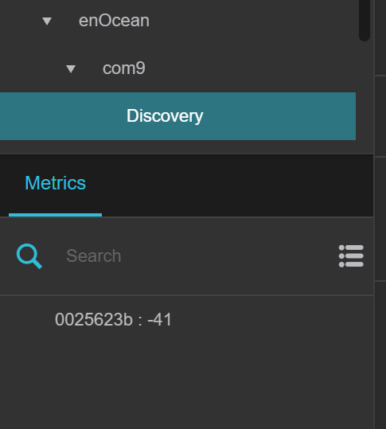

# dslink-java-enocean

## Usage

In order to talk to EnOcean devices, you first need to connect an EnOcean transciever (such as [this USB dongle](https://www.enocean.com/en/enocean-modules/details/usb-300-oem/)) to your machine. In the EnOcean DSLink, invoke the "add connection" action with the serial port corresponding to your EnOcean transciever.

 

 

This will create a connection node, which has a child node called "Discovery". Now you will need to teach-in your devices. For most EnOcean devices, pressing a button on the device will cause it to broadcast a telegram. When the DSLink picks up this telegram, it will create a (temporary) new child under "Discovery" to represent the device.

 

 

In order to interact with the device, we must first add it to our list of devices by invoking the "add" action on the temporary device node. This action lets you specify a name for the device and choose what device profile to use for it.

 

 

Invoking the "add" action will remove the temporary node from "Disovery" and create a new node under "Devices". This device node exposes the device's capabilities.

 

 
